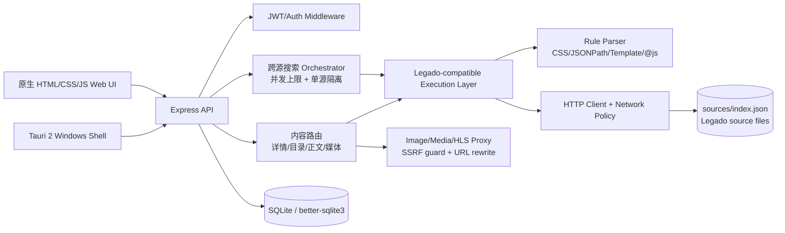

# TiangongBaoku

TiangongBaoku 是一个内容聚合工作台：用一个 Node.js/Express 模块化单体承载小说、漫画、听书、音乐、影视和工具型源的统一检索与消费体验，并提供 Windows Tauri 2 桌面壳。

它与开源软件“阅读”（Legado）的关系是**格式兼容，而不是代码复用**。项目参考 Legado 书源字段和规则语义，独立实现了 Node.js 版轻量执行层，当前仓库没有引入 Legado Android/Kotlin 原版引擎。

## 架构



分层是模块化单体，而非拆分部署的微服务：

| 层 | 代码位置 | 责任 |
| --- | --- | --- |
| Presentation | `app/` | 搜索、详情、阅读器、漫画、音频/视频播放器、统一状态 |
| API | `server/routes/` | 认证、源管理、搜索、内容、收藏、历史、媒体接口 |
| Orchestration | `server/routes/search.js`、`server/routes/content.js` | 跨源 fan-out/fan-in、超时、结果归一化、失败隔离 |
| Execution | `server/engine/` | 读取书源、构造 URL、请求页面、执行规则链和受限 JS |
| Persistence | `server/db/` | SQLite schema、迁移、用户收藏/历史/缓存 |
| Desktop | `src-tauri/` | Tauri 2 壳、运行时准备、Windows 打包 |

### 规则执行链路

`source JSON -> URL/template expansion -> HTTP policy check -> fetch -> ruleBookInfo/ruleSearch/ruleToc/ruleContent -> CSS/JSONPath/@js evaluation -> URL normalization -> Unified Payload -> renderer`

兼容范围包括常用 `class.*/tag.*@text|@href|@src`、JSONPath、`||` 备选规则、`{{key}}/{{page}}` 模板、正则替换，以及沙箱中的部分 `java.getString/getElements/base64/md5/cookie/source/cache` API。复杂 Android/Java、登录交互和站点专有加密不保证兼容。

### 统一 Payload 与媒体

所有搜索和详情结果都会映射到统一字段（`id/title/author/coverUrl/intro/source/category/items`），前端渲染器不依赖某一个站点 DOM。图片、音频、视频和 HLS 经过代理时执行 HTTP/HTTPS 校验、私网解析拦截、重定向上限和 HLS 相对 URI 重写；默认拒绝 localhost、RFC1918、链路本地和解析到私网的域名。

## 源统计与实测指标

源索引统计的是**配置数量**，不是保证可访问的网站数量：

| 类别 | 配置 | 启用 |
| --- | ---: | ---: |
| 小说 | 271 | 269 |
| 漫画 | 50 | 44 |
| 听书 | 17 | 14 |
| 音乐 | 7 | 7 |
| 影视 | 17 | 7 |
| 游戏 | 3 | 3 |
| 特殊工具 | 28 | 28 |
| **合计** | **393** | **372** |

2026-08-10 实测环境：Windows x64、Node v24.15.0、20 个逻辑处理器。

| 指标 | 样本 | 结果 |
| --- | --- | --- |
| 本地规则微基准 | 100 次；模板/CSS/JSONPath/URL 各 1 个 fixture | P50 **0.049ms**；P95 **0.177ms** |
| Demo 冷启动 | 7 次；进程启动到 `/api/health` 返回 200；临时 SQLite | P50 **662.4ms**；P95 **923.6ms** |
| 外部源搜索小样本 | 分类别抽取 27 个启用源；固定关键词；单源超时 2500ms | 7 成功、1 空结果、10 失败、3 超时、6 跳过；P50 **568.7ms**；P95 **2736.7ms**；成功率 **25.9%** |

因此本次只能声明：393 个配置、372 个启用配置、**27 个样本中 7 个可验证搜索成功**。`verified` 不等于全部启用源可用，也不证明详情/正文长期可用、内容授权或站点 SLA。延迟按全部样本从调用到完成/失败统计，受公网和目标站状态影响。原始匿名报告见 [`docs/source-metrics.json`](docs/source-metrics.json)、[`docs/runtime-metrics.json`](docs/runtime-metrics.json) 和 [`docs/source-verification.json`](docs/source-verification.json)。

可复现命令：

```powershell
node scripts/collect_source_metrics.js --out docs/source-metrics.json
node scripts/benchmark_startup.js --iterations 7 --out docs/runtime-metrics.json
node scripts/verify_sources.js --sample 28 --out docs/source-verification.json
```

联网验证不在 CI 中默认运行。重跑结果会随网络和第三方源变化，报告不会保存目标地址、请求头或凭据。

## 本地运行

环境：Node.js 18+（推荐 20 LTS）、npm；桌面端另需 Rust、WebView2 和 Tauri 依赖。

```powershell
npm ci
npm ci --prefix server
Copy-Item .env.example .env
# 生产或公网部署前必须替换 JWT_SECRET，并收紧 CORS_ORIGIN
npm run server
```

打开 <http://127.0.0.1:3456>，健康检查：<http://127.0.0.1:3456/api/health>。

### 匿名 Demo

```powershell
npm run demo
```

`DEMO_MODE` 提供 5 个本地合成 fixture，覆盖搜索、详情、目录以及小说文字、漫画图片、听书/音乐静音 WAV、视频本地页面的统一 Payload 链路。它不请求第三方内容，也不包含受保护正文、账号或个人数据；它只证明前后端链路可演示，不证明真实外部源可用或拥有内容授权。

演示截图脚本位于 `scripts/capture_portfolio_screenshots.js`。本次发布环境中的 Playwright CLI/Chromium 启动连续超时，因此没有把旧截图作为 v0.2.0 演示图发布；Demo API 与离线集成测试均已通过。

桌面开发与构建：

```powershell
npm run tauri:dev
npm run tauri:build
```

v0.2.0 已在上述 Windows 环境完成 Tauri release 构建，生成 x64 NSIS 安装包。安装包随 GitHub Release 发布，SHA-256 为 `E155970BF68AE4D0BD2D3C5038C3389CD7E681CC78553883456D49EE8F2023B9`；兼容范围与已知限制见 [`docs/release-notes-v0.2.0.md`](docs/release-notes-v0.2.0.md)。

## 测试与 CI

```powershell
npm test
node scripts/audit_public_release.js --ci
```

当前离线套件为 **10/10 通过**，覆盖规则解析、URL/模板、@js 沙箱、并发上限、SSRF 网络策略、HLS 重写、漫画 fallback、健康/版本 API、Demo 统一 Payload 和分类元数据。GitHub Actions 在 Node 18/20/22 矩阵中执行同一套测试；真实外部源检查需人工触发。

## 安全与合规边界

- 生产环境必须设置高熵 `JWT_SECRET`、HTTPS、严格 `CORS_ORIGIN`、反向代理和限流；`ALLOW_PRIVATE_NETWORK_FETCH=true` 只允许受控内网开发场景。
- 不要提交 `.env`、Cookie、Authorization、API Key、数据库、日志、个人账号或运行时缓存。发布前运行 `node scripts/audit_public_release.js --ci`。
- 仓库只提供解析与聚合技术，不托管或保证第三方内容的版权、可用性或合法性。使用者必须遵守目标站点条款、robots、版权和当地法律，并对自己导入的源负责。
- Legado/“阅读”名称和规范归其各自项目与贡献者所有；本项目是独立兼容实现，不隶属于原项目。
- 历史审计、第三方源风险和清理记录见 [`docs/public-release-audit.md`](docs/public-release-audit.md)。

## 故障排查

| 现象 | 建议 |
| --- | --- |
| 源列表为空 | 检查 `SOURCES_PATH`、`sources/index.json` JSON 格式和 `enabled` 字段 |
| 单个源超时 | 查看日志中的源名和阶段；降低 `SEARCH_CONCURRENCY`，不要放宽私网策略 |
| 正文为空 | 站点 HTML/接口规则已变化，先用本地 fixture 验证规则，再决定是否停用该源 |
| 图片/HLS 播放失败 | 检查源 URL、重定向和 CORS；代理会拒绝私网、非 HTTP(S) 和过多重定向 |
| 生产启动报 JWT_SECRET 错误 | 设置随机 `JWT_SECRET`，不要使用 README 或示例中的占位值 |

## 项目边界与后续方向

当前目标是可读、可测试、可演示的单机应用，不承诺多租户、分布式调度、离线版权内容或生产 SLA。后续可演进方向包括规则 AST 缓存、熔断/健康评分、可观测性、端到端匿名 fixture 演示和可审计的源供应链。

## License

代码采用 ISC License，见 [`LICENSE`](LICENSE)。第三方依赖和外部源各自遵循其许可证与服务条款；源配置不等于内容授权。
